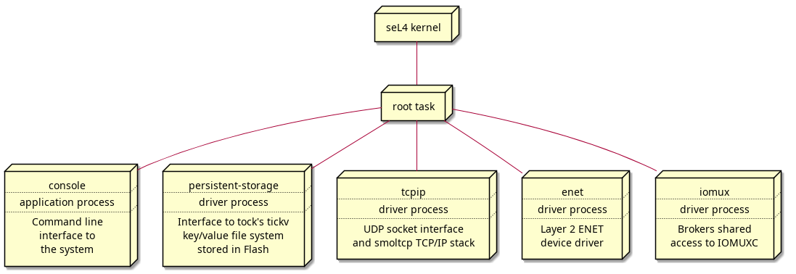
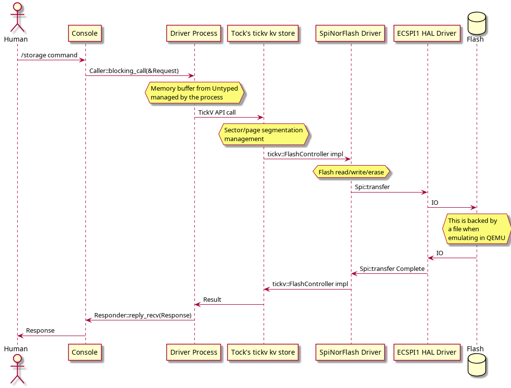

# Rust seL4 toy system built on ferros for the imx6 sabrelite platform

* [ferros](https://github.com/auxoncorp/ferros): A Rust-based userland which also adds compile-time assurances to seL4 development
* [QEMU sabrelite machine](https://qemu.readthedocs.io/en/latest/system/arm/sabrelite.html)
* [device tree](https://github.com/seL4/seL4/blob/4d0f02c029560cae0e8d93727eb17d58bcecc2ac/tools/dts/sabre.dts)
* [IMX6DQRM refman](http://cache.freescale.com/files/32bit/doc/ref_manual/IMX6DQRM.pdf)
* [HW user manual](https://boundarydevices.com/wp-content/uploads/2014/11/SABRE_Lite_Hardware_Manual_rev11.pdf)
* [HW components](https://boundarydevices.com/sabre_lite-revD.pdf)
* [imx6 platform sdk](https://github.com/flit/imx6_platform_sdk)
* [TickV](https://github.com/tock/tock/tree/master/libraries/tickv)

## Overview

### Process Tree



### Persistent Storage



TODO - diagrams for enet, tcpip, iomux

## Getting Started

### Dependencies

* [rust](https://www.rust-lang.org/tools/install) (nightly)
    ```bash
    curl --proto '=https' --tlsv1.2 -sSf https://sh.rustup.rs | sh
    rustup install nightly
    rustup target add armv7-unknown-linux-gnueabihf
    ```

* [qemu-system-arm](https://www.qemu.org/download/) (for simulation, version >= 6.0.1)
    ```bash
    wget https://download.qemu.org/qemu-6.1.0.tar.xz
    tar xvJf qemu-6.1.0.tar.xz
    cd qemu-6.1.0
    ./configure --target-list=arm-softmmu,arm-linux-user
    make -j 4
    sudo make install
    ```

* seL4 Python build dependencies
    ```bash
    pip3 install --user setuptools sel4-deps
    ```

* [selfe](https://github.com/auxoncorp/selfe-sys)
    ```bash
    cargo install --git https://github.com/auxoncorp/selfe-sys selfe-config --bin selfe --features bin --force
    ```

### Buidling

Log level can be set at build-time with the `RUST_ENV` environment
variable (`off`, `error`, `warn`, `info`, `debug`, `trace`).
The default is `RUST_LOG=debug`.

```bash
./scripts/build.sh
```

### Simulating

When using QEMU, the script [mkflash.sh](scripts/mkflash.sh) setups up a binary file
to back the flash storage (`target/flash/flash.bin`).

In a separate terminal, run the QEMU networking script:
```bash
sudo ./scripts/setup-networking.sh
Adding interface 'qemu-net'
```

```bash
./scripts/simulate.sh
```

```text
ELF-loader started on CPU: ARM Ltd. Cortex-A9 r0p0
  paddr=[20000000..20825037]
No DTB found!
Looking for DTB in CPIO archive...
Found dtb at 200e1254
Loaded dtb from 200e1254
   paddr=[10041000..1004bfff]
ELF-loading image 'kernel'
  paddr=[10000000..10040fff]
  vaddr=[e0000000..e0040fff]
  virt_entry=e0000000
ELF-loading image 'root-task'
  paddr=[1004c000..1047efff]
  vaddr=[10000..442fff]
  virt_entry=22eac
ELF loader relocated, continuing boot...
Bringing up 3 other cpus
Enabling MMU and paging
Jumping to kernel-image entry point...

Bootstrapping kernel
Booting all finished, dropped to user space
DEBUG: [root-task] Initializing version=0.1.0 profile=debug
DEBUG: [root-task] Found iomux ELF data size=3085664
DEBUG: [root-task] Found enet ELF data size=4850064
DEBUG: [root-task] Found tcpip ELF data size=5925980
DEBUG: [root-task] Found persistent-storage ELF data size=4913648
DEBUG: [root-task] Found console ELF data size=5142756
DEBUG: [root-task] Setting up iomux driver
DEBUG: [root-task] Setting up tcpip driver
DEBUG: [root-task] Setting up enet driver
DEBUG: [root-task] Setting up persistent-storage driver
DEBUG: [root-task] Setting up console application
DEBUG: [iomux] Process started
DEBUG: [enet-driver] Process started
DEBUG: [tcpip-driver] Process started
DEBUG: [persistent-storage] Process started
DEBUG: [persistent-storage] storage vaddr=0x66000 size=4096
DEBUG: [persistent-storage] scratchpad vaddr=0x67000 size=4096
DEBUG: [iomux] Processing request ConfigureEcSpi1
DEBUG: [persistent-storage] Configured ECSPI1 IO resp=EcSpi1Configured
DEBUG: [tcpip-driver] TCP/IP stack is up IP=192.0.2.80 MAC=00:AD:BE:EF:CA:FE
DEBUG: [console] Process started
INFO: [console] Run 'telnet 0.0.0.0 8888' to connect to the console interface (QEMU)
```

Telnet to get at the console:
```bash
telnet 0.0.0.0 8888
```

```bash
***************************
* Welcome to the console! *
***************************

> help
AVAILABLE ITEMS:
  storage
  net
  help [ <command> ]

> help storage
SUMMARY:
  storage

DESCRIPTION:
Enter the persistent storage sub-menu.

> storage

/storage> help
AVAILABLE ITEMS:
  append <key> <value>
  get <key>
  invalidate <key>
  gc
  exit
  help [ <command> ]

> help net
SUMMARY:
  net

DESCRIPTION:
Enter the network sub-menu.

> net

/net> help
AVAILABLE ITEMS:
  sendto <addr> <port> <data>
  exit
  help [ <command> ]
```

You can ping the IP stack (smoltcp):
```bash
ping -4 192.0.2.80

PING 192.0.2.80 (192.0.2.80) 56(84) bytes of data.
64 bytes from 192.0.2.80: icmp_seq=1 ttl=64 time=44.4 ms
64 bytes from 192.0.2.80: icmp_seq=2 ttl=64 time=8.38 ms
64 bytes from 192.0.2.80: icmp_seq=3 ttl=64 time=8.61 ms
```

Send UDP data from the console.
On the remote side:
```bash
netcat -lu 192.0.2.2 4567
```

In the console:
```bash
> net

/net> sendto 192.0.2.2 4567 hello
```
